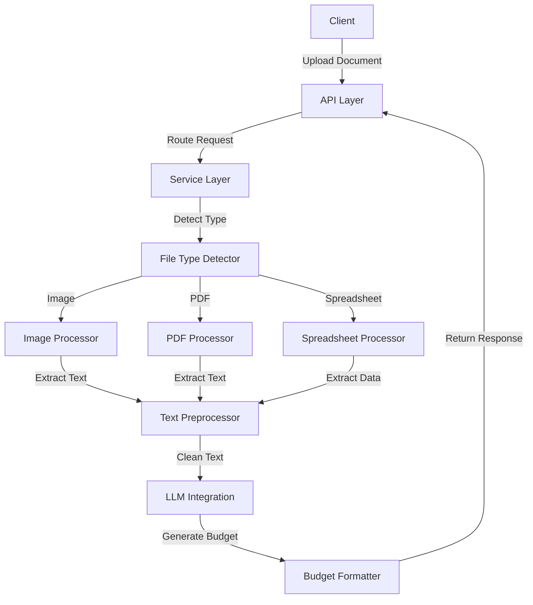

# Design Document: Document Processing Module

## Overview

The Document Processing module is a critical component of the Bubblle Agent CRM platform that handles the extraction, processing, and analysis of text from various document formats. This module serves as a bridge between raw client documents and the LLM services that generate budgets and responses.

The design follows a modular architecture with clear separation of concerns, allowing for easy maintenance and extensibility. The module is designed to be deployed as a containerized service within the larger platform architecture.

## Architecture

The Document Processing module follows a layered architecture:

1. **API Layer**: Handles HTTP requests for document uploads and processing
2. **Service Layer**: Orchestrates the document processing workflow
3. **Processor Layer**: Contains specialized processors for each document type
4. **Utility Layer**: Provides shared functionality across processors

### High-Level Architecture Diagram



## Components and Interfaces

### 1. File Upload Controller

Responsible for handling file uploads and initiating the processing workflow.

```typescript
interface FileUploadController {
  uploadFile(req: Request, res: Response): Promise<Response>;
  getProcessingStatus(req: Request, res: Response): Promise<Response>;
}
```

### 2. Document Processing Service

Orchestrates the overall document processing workflow.

```typescript
interface DocumentProcessingService {
  processDocument(file: UploadedFile): Promise<ProcessingResult>;
  combineResults(results: ProcessingResult[]): Promise<CombinedResult>;
}
```

### 3. File Type Detector

Detects the type of uploaded files and routes them to the appropriate processor.

```typescript
interface FileTypeDetector {
  detectType(file: UploadedFile): FileType;
  isSupported(fileType: string): boolean;
}
```

### 4. Document Processors

Specialized processors for each document type.

```typescript
interface DocumentProcessor {
  process(file: UploadedFile): Promise<ExtractedText>;
  validate(file: UploadedFile): boolean;
}

interface ImageProcessor extends DocumentProcessor {
  performOCR(imagePath: string, language?: string): Promise<string>;
  optimizeImage(imagePath: string): Promise<string>;
}

interface PDFProcessor extends DocumentProcessor {
  extractText(pdfPath: string): Promise<string>;
  isSearchablePDF(pdfPath: string): boolean;
}

interface SpreadsheetProcessor extends DocumentProcessor {
  extractData(filePath: string): Promise<SpreadsheetData>;
  formatAsText(data: SpreadsheetData): string;
}
```

### 5. Text Preprocessor

Cleans and normalizes extracted text before sending to LLMs.

```typescript
interface TextPreprocessor {
  clean(text: string): string;
  tokenize(text: string): string[];
  removeStopwords(tokens: string[], language?: string): string[];
  format(tokens: string[]): string;
}
```

### 6. LLM Integration Service

Handles communication with LLM providers for budget generation.

```typescript
interface LLMIntegrationService {
  generateBudget(processedText: string): Promise<string>;
  formatResponse(rawResponse: string): FormattedBudget;
}
```

## Data Models

### UploadedFile

```typescript
interface UploadedFile {
  id: string;
  originalName: string;
  path: string;
  mimeType: string;
  size: number;
  uploadedAt: Date;
  userId: string;
}
```

### ProcessingResult

```typescript
interface ProcessingResult {
  fileId: string;
  extractedText: string;
  processingTime: number;
  status: 'success' | 'failed';
  error?: string;
}
```

### SpreadsheetData

```typescript
interface SpreadsheetData {
  sheets: {
    name: string;
    headers: string[];
    rows: Record<string, any>[];
  }[];
}
```

### FormattedBudget

```typescript
interface FormattedBudget {
  id: string;
  title: string;
  description: string;
  items: BudgetItem[];
  total: number;
  currency: string;
  createdAt: Date;
  validUntil: Date;
}

interface BudgetItem {
  id: string;
  description: string;
  quantity: number;
  unitPrice: number;
  total: number;
}
```

## Error Handling

The module implements a comprehensive error handling strategy:

1. **Validation Errors**: Returned when uploaded files don't meet requirements
2. **Processing Errors**: Occur during document processing
3. **Integration Errors**: Happen when communicating with external services

All errors are logged with appropriate context and returned to the client with clear messages.

```typescript
interface ProcessingError {
  code: string;
  message: string;
  details?: any;
  timestamp: Date;
}
```

## Testing Strategy

The testing strategy for the Document Processing module includes:

1. **Unit Tests**: For individual components and utilities
   - Test each processor with various file formats
   - Validate text preprocessing functions
   - Mock external dependencies

2. **Integration Tests**: For end-to-end workflows
   - Test complete processing pipeline
   - Verify correct routing based on file types
   - Test error handling scenarios

3. **Performance Tests**: To ensure scalability
   - Test with large files
   - Measure processing times
   - Verify concurrent processing capabilities

## Implementation Considerations

### OCR Implementation

For image processing, we'll use Tesseract.js with Portuguese language support. The implementation will:

1. Optimize images before OCR if needed
2. Support multiple image formats
3. Handle text extraction with appropriate error handling

```typescript
// Example implementation approach
const performOCR = async (imagePath: string, language = 'por') => {
  try {
    const result = await Tesseract.recognize(
      imagePath,
      language,
      { logger: m => console.log(m) }
    );
    return result.data.text;
  } catch (error) {
    logger.error('OCR processing failed', { error, imagePath });
    throw new ProcessingError({
      code: 'OCR_FAILED',
      message: 'Failed to extract text from image'
    });
  }
};
```

### PDF Processing

For PDF processing, we'll use pdf-parse with fallback to OCR for scanned documents:

1. Detect if PDF is searchable or scanned
2. Extract text directly if searchable
3. Use OCR if the PDF contains only images
4. Handle multi-page documents

### Spreadsheet Processing

For spreadsheet processing, we'll use xlsx library:

1. Extract data from all sheets
2. Preserve column headers and relationships
3. Convert tabular data to structured text format
4. Handle various Excel and CSV formats

### Text Preprocessing Pipeline

The text preprocessing pipeline will include:

1. Character normalization
2. Tokenization
3. Optional stopword removal
4. Formatting for LLM consumption

### Containerization

The module will be containerized using Docker:

1. Use a lightweight Node.js base image
2. Install necessary dependencies for OCR and PDF processing
3. Configure appropriate resource limits
4. Implement health checks

## Security Considerations

1. **File Validation**: Strict validation of uploaded files to prevent security issues
2. **Temporary Storage**: Secure storage of uploaded files with automatic cleanup
3. **Access Control**: Proper authentication and authorization for API endpoints
4. **Data Sanitization**: Sanitization of extracted text before processing
5. **Rate Limiting**: Implementation of rate limits to prevent abuse

## Performance Optimization

1. **Asynchronous Processing**: Handle document processing asynchronously
2. **Worker Pools**: Use worker threads for CPU-intensive tasks
3. **Caching**: Cache processing results when appropriate
4. **Resource Management**: Implement proper resource allocation and cleanup
5. **Monitoring**: Add performance metrics for monitoring and optimization